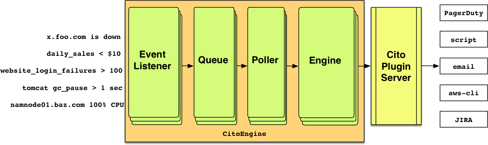

Getting Started
===============

Architecture
------------

The entire system is divided in two groups: ``event_listener``, ``queue``, ``poller`` and ``engine`` fall in the CitoEngine group whereas
``plugin_server`` is a standalone service.

All alerts enter the system via the ``event_listener`` and are sent over to the ``queue``. A ``poller`` reading this
``queue`` fetches these events and begins to parse them. If a given event matches a definition in the system, it is accepted as
an *Incident*. Each *Event* has one or more user-defined *EventActions*. The ``engine`` checks the threshold in real-time and
fires the *EventAction*. Thresholds, at the moment, are limited to a conditional match of ``X events in Y seconds``.
The *EventAction* is simply telling the ``plugin_server`` to execute the user-defined plugin with the user-defined (customizable)
parameters.

CitoEngine Terminology
----------------------

CitoEngine's web interface allows you to define Events, Teams, Categories, Users and PluginServers.

**Events**: An event definition includes a Summary, Description, owning **Team**, Severity and **Category**. Only members of the
owning **Team** can act on **Incidents** generated upon this **Event**. No two Teams can share the same Event.

**Teams**: Each team can have one or more **Users** and **Events** associated with them.

**Category**: This is a generic classifier for events. Example categories could be Network, Disk, CPU, etc. These categories
do not affect the behavior of the **EventActions**.

**Users**: One user per installation. User can be part of multiple Teams. User permissions are as under:

 * ``SuperAdmin``: Can do just about anything.
 * ``Admin``: Can add teams.
 * ``User``: Can add events and action incidents.
 * ``NOC``: Can comment.
 * ``ReportsUser``: Can only view reports.

**Plugin Server Definition**: **Users** can add links to the plugin server. Once added, the system will fetch the active plugins.
These plugins can now be accessed by the users in **Events** -> **EventActions**.

**EventActions**: Users can define which plugin to execute based on a given threshold. The user can send any number of
parameters to the remote plugin. CitoEngine comes with a few internal variables which can be use sent as parameters:

 * ``__ELEMENT__`` Engine send the ``element`` name
 * ``__EVENTID__`` Engine send the ``event`` ID
 * ``__INCIDENTID__`` Engine send the ``incident`` ID
 * ``__MESSAGE__`` Engine send the ``message`` which came in by the alerting system.