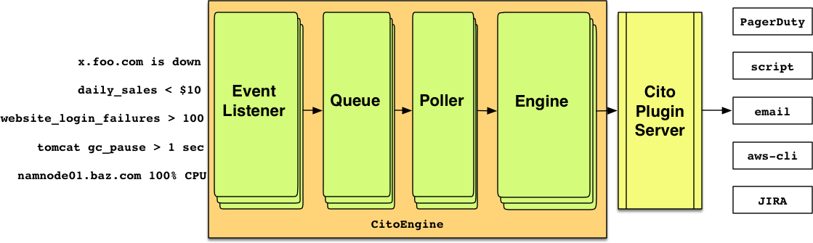

========
Overview
========

**The problem:**

Configuring monitoring systems to alert properly is an art.
It's a fine art of configuring thresholds when your monitoring parameters vary widely or when the monitoring tools lack capability to monitor dynamic workloads.
It also takes discipline in working with monitoring systems during release process or outages.
Not all monitoring systems are configured or maintained properly. In the end you have alerts and lots of it!

**What is CitoEngine ?**

CitoEngine allows you to manage large volume of alerts and trigger actions.
These actions could notify or act on the alert by executing a script (a plugin).
It is ideal alert management service for teams who have multiple monitoring systems.

**What can it do?**

 * Accept alerts from *any* monitoring systems such as ``Nagios``, ``Sensu``, ``Cron-jobs``, etc. and aggregate alerts.
 * Lookup such alerts (called **Incidents**) to user-defined **Event** ID's and enable any action based on rules that meet a user-defined criteria
 * **Plugins** enable actions on **Incidents**. **Plugins** can be any script that run commands or make API calls.
 * **Dashboards** to give you an overview of all incoming alerts or grouped by **Teams**
 * It does *not* require any agents.
 * It plugins can be *any* executable script, no pesky DSL's.

**What it is not:**

CitoEngine is not a monitoring system.

**How do I use it?**

Now that you know what CitoEngine is, we will walk you through how you can use it.

CitoEngine is built on open source technologies and designed to run on Linux. It's built on the following components

* Python 2.7+ 
* Django 1.8+
* MariaDB / MySQL 5.5.x (PostgreSQL support coming soon)
* RabbitMQ and AWS SQS (for queue)

CitoEngine can be run on a standalone server or on a Virtual Machine running Ubuntu 64bit >= 12.04 LTS.

.. note:: Official Docker images are coming soon.

.. _architecture:

Architecture
------------

The entire system is divided in two groups: ``event_listener``, ``queue``, ``poller`` and ``engine`` fall in the CitoEngine group whereas
``plugin_server`` is a standalone service called CitoPluginServer.

All alerts enter the system via the ``event_listener`` api call and are sent over to the ``queue``. A ``poller`` reading this
``queue`` fetches these events and begins to parse them. If a given event matches a definition in the system, it is accepted as
an *Incident*. Each *Event* has one or more user-defined *EventActions*. The ``engine`` checks the threshold in real-time and
fires the *EventAction*. Thresholds, at the moment, are limited to a conditional match of ``X events in Y seconds``.
The *EventAction* is simply telling the ``plugin_server`` to execute the user-defined plugin with the user-defined (customizable)
parameters.

.. _terminology:

CitoEngine Terminology
----------------------

CitoEngine's web interface allows you to define Events, Teams, Categories, Users and PluginServers.

.. _events:

**Events**: An event definition includes a Summary, Description, owning **Team**, Severity and **Category**. Only members of the
owning **Team** can act on **Incidents** generated upon this **Event**. No two Teams can share the same Event.

.. _incidents:

**Incidents** Any alert coming into the system (with a valid Event Code) is defined as an Incident.

.. _teams:

**Teams**: Each team can have one or more **Users** and **Events** associated with them.

.. _category:

**Category**: This is a generic classifier for events. Example categories could be Network, Disk, CPU, etc. These categories
do not affect the behavior of the **EventActions**.

.. _user:

**Users**: One user per installation. User can be part of multiple Teams. User permissions are as under:

 * ``SuperAdmin``: Can do just about anything.
 * ``Admin``: Can add teams.
 * ``User``: Can add events and action incidents.
 * ``NOC``: Can comment.
 * ``ReportsUser``: Can only view reports.

.. _pluginserver:

**Plugin Server Definition**: **Users** can add links to the plugin server. Once added, the system will fetch the active plugins.
These plugins can now be accessed by the users in **Events** -> **EventActions**.

.. _eventactions:

**EventActions**: Users can define which plugin to execute based on a given threshold. The user can send any number of
parameters to the remote plugin. CitoEngine comes with a few internal variables which can be use sent as parameters:

 * ``__ELEMENT__`` Engine send the ``element`` name
 * ``__EVENTID__`` Engine send the ``event`` ID
 * ``__INCIDENTID__`` Engine send the ``incident`` ID
 * ``__MESSAGE__`` Engine send the ``message`` which came in by the alerting system.

.. _suppression:

**Suppression**: CitoEngine allows you to suppress an *event*, an *element* or a combination of both. By suppressing an
event and/or element, there will not be any eventaction taken against incidents against them.
